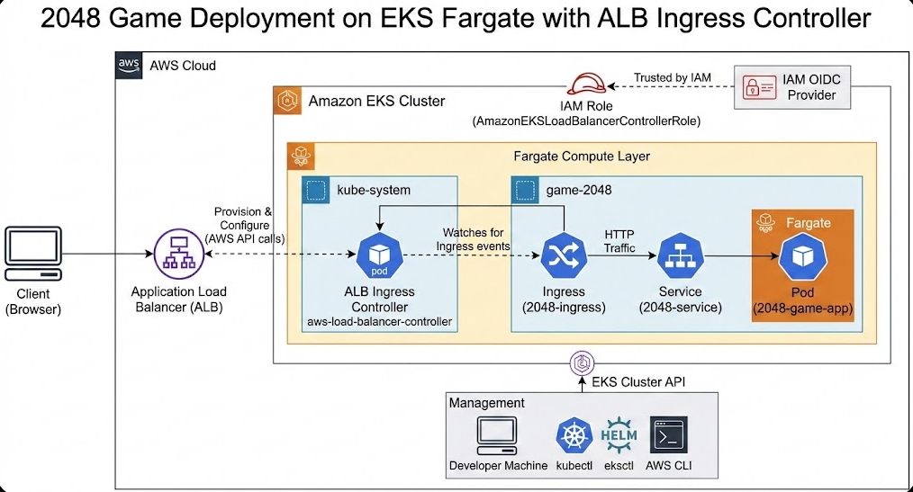

This repo walks through deploying the classic 2048 web game on an Amazon EKS cluster using Fargate, ALB Ingress Controller, and IAM OIDC integration.
The goal is to learn each piece of the EKS ecosystem by configuring it manually — cluster creation, Fargate profiles, IAM roles, OIDC, Ingress, and the ALB controller — and then combining them into a clean, production-style deployment.


# Architecture Overview


A public-facing ALB handles incoming HTTP traffic.
The ALB Ingress Controller maps these rules to Kubernetes Ingress.
Traffic flows:

`Client → ALB → Ingress → Service → Pod`

Everything runs on Fargate, so the underlying compute is fully managed.
---


## 🚀 Step 1: Prerequisites
- Install kubectl: https://kubernetes.io/docs/tasks/tools/
- Run this command:
```
curl -LO "https://dl.k8s.io/release/$(curl -L -s https://dl.k8s.io/release/stable.txt)/bin/linux/amd64/kubectl"
chmod +x kubectl
sudo mv kubectl /usr/local/bin/
```

- Install AWS CLI: https://docs.aws.amazon.com/cli/latest/userguide/getting-started-install.html
- Run this command:
```
sudo apt remove awscli
curl "https://awscli.amazonaws.com/awscli-exe-linux-x86_64.zip" -o "awscliv2.zip"
unzip awscliv2.zip
sudo ./aws/install
```
- Check its installed correctly: `aws version --client`

- Configure AWS CLI to use in local machine terminal: `aws configure`

(Use access keys from AWS → Security Credentials)

- Install eksctl: https://docs.aws.amazon.com/eks/latest/userguide/install-kubectl.html#eksctl-install-update
- Run this command:
```
curl -sL "https://github.com/eksctl-io/eksctl/releases/latest/download/eksctl_$(uname -s)_amd64.tar.gz" | tar xz -C /tmp
sudo mv /tmp/eksctl /usr/local/bin
```
- Check if its installed correctly: `eksctl version`
---

## 🚀 Step 2: Create the EKS Cluster
- Create cluster using Fargate:
```
eksctl create cluster --name <cluster-name> --region us-west-2 --fargate
```
- Delete when needed:
```
eksctl delete cluster --name <cluster-name> --region us-west-2
```

- Update kubeconfig to access cluster: From AWS Console → EKS → Cluster → Config Instructions
Or run:
```
aws eks update-kubeconfig --name <cluster-name> --region us-west-2
```

- Useful commands:
```
access a cluster: `kubectl config use-context <cluster-name>`
list of available cluster: `kubectl config get-contexts`
check current cluster: `kubectl get nodes`
```

## 🚀 Step 3: Fargate Profile + App Deployment

- Create Fargate profile:
```
eksctl create fargateprofile --cluster demo-cluster --region us-west-2 --name alb-sample-app --namespace game-2048
```
- Deploy the sample app (Deployment + Service + Ingress):
```
kubectl apply -f manifest.yaml
```
  

## 🚀 Step 4: Configure OIDC Provider

- Check if OIDC provider already exists:
```
aws iam list-open-id-connect-providers | grep $oidc_id | cut -d "/" -f4
```
- If not present:
```
eksctl utils associate-iam-oidc-provider --cluster $cluster_name --region us-west-2 --approve
```
  

## 🚀 Step 5: IAM Policy & IAM Service Account

- Download IAM policy:
```
curl -O https://raw.githubusercontent.com/istiak-devsecops/game-2048/refs/heads/main/iam_policy.json
```
- Create IAM Policy:
```
aws iam create-policy --policy-name AWSLoadBalancerControllerIAMPolicy --policy-document file://iam_policy.json
```
- Create IAM Role for ALB Controller:
```
eksctl create iamserviceaccount \
  --cluster=<your-cluster-name> \
  --namespace=kube-system \
  --name=aws-load-balancer-controller \
  --role-name AmazonEKSLoadBalancerControllerRole \
  --attach-policy-arn=arn:aws:iam::<your-account-id>:policy/AWSLoadBalancerControllerIAMPolicy --region us-west-2 \
  --approve
```

## 🚀 Step 6: Install ALB Ingress Controller (Helm)

- Add Helm repo:
```
helm repo add eks https://aws.github.io/eks-charts
helm repo update eks
```
- Install controller:
```
helm install aws-load-balancer-controller eks/aws-load-balancer-controller \
  -n kube-system \
  --set clusterName=<your-cluster-name> \
  --set serviceAccount.create=false \
  --set serviceAccount.name=aws-load-balancer-controller \
  --set region=<your-region> \
  --set vpcId=<your-vpc-id>
```
- Verify deployment:
```
kubectl get deployment -n kube-system aws-load-balancer-controller
```
